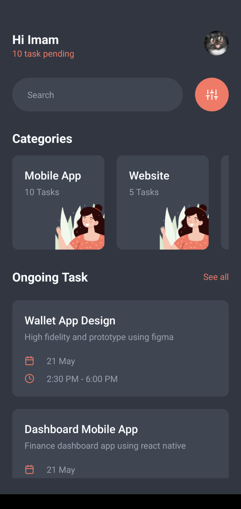
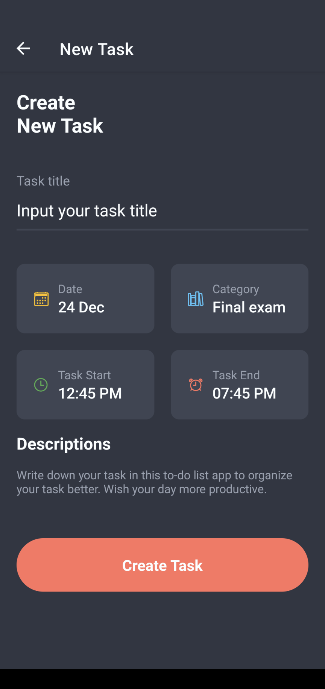
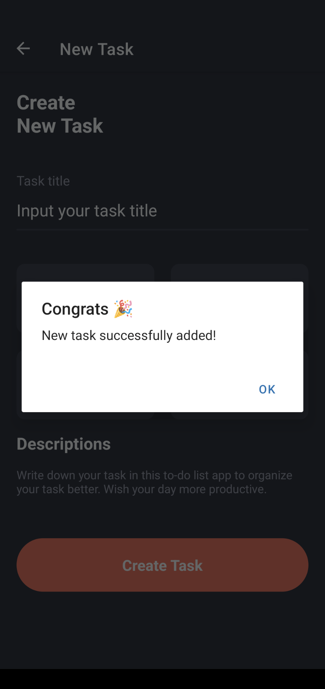

# Juju To Do List

Aplikasi manajemen task untuk tugas final exam.

## Deskripsi

Aplikasi mobile ini membantu kamu untuk manajemen task dan waktu agar tidak ada prioritas yang terlewatkan.

## Fitur

Berikut adalah beberapa fitur yang tersedia di aplikasi ini:
- Search : cari berdasarkan nama dan kategori task.
- Filter and Sort : agar kamu lebih mudah menemukan task yang telah kamu tambahkan sebelumnya.
- Kategori : agar kamu lebih mudah dalam memilah jenis pekerjaan.
- Ongoing task : berisi daftar pekerjaan yang belum kamu selesaikan.
- Create new task : tambahkan pekerjaan berikut detailnya pada hari dan waktu tertentu.
- User profile : untuk mengetahui progress kamu selama ini.

## Instalasi

Berikut adalah langkah-langkah untuk menginstal project kamu:

1. Clone repository ini.
2. Buka terminal dan navigasi ke direktori project.
3. Jalankan perintah `npm install` atau `yarn install`.
4. Setalah instalasi selesai, jalankan perintah `npx expo start`.
5. Pada saat development, kita menggunakan aplikasi Expo Go untuk melihat preview aplikasi. Maka dari itu, download aplikasi Expo Go di play store.
6. Buka aplikasi Expo Go, pilih menu Scan QR Code.
7. Scan QR Code yang ada pada terminal setelah project expo di-start.
8. Tunggu sampai aplikasi berhasil didownload dan dijalankan

## Teknologi yang Digunakan

Berikut adalah teknologi yang digunakan dalam project ini:

- React Native
- Expo
- React Navigation

## Tangkapan layar aplikasi
Home Screen | Create New Task | Success Create Task
:-------------------------:|:-------------------------:|:-------------------------:
 |  |  
